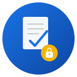

<p align="center">
  
</p>

<h1 align="center">SimpleSign</h1>

<p align="center">
  <strong>PAdES digital signatures for .NET</strong><br/>
  Sign, validate, and inspect PDFs — no BouncyCastle required.
</p>

<p align="center">
  
  
  
  
  
  
  
</p>

---

## What is SimpleSign?

SimpleSign is a .NET library for creating and validating **PAdES** (ETSI EN 319 142) and **CAdES** (ETSI EN 319 122) digital signatures. All cryptography uses `System.Security.Cryptography` — no BouncyCastle, no third-party crypto dependencies.

---

## Why SimpleSign?

- **Zero third-party crypto** — all operations via BCL `System.Security.Cryptography`
- **Native AOT compatible** — no reflection, no `dynamic`, no `Assembly.Load`
- **MIT licensed** — use anywhere, for anything, with no restrictions
- **1,500+ tests** — comprehensive coverage, 0 warnings, CI-enforced quality gates
- **Multi-target** — .NET 8 and .NET 10 on Windows, macOS, and Linux

---

## What's New in v0.6.0

**Fluent CAdES Builder** — `CadesSignerBuilder` brings the same fluent immutable builder pattern used in PAdES to standalone CMS signatures. `DeferredSignerBuilder` renamed `WithSignatureAlgorithmOid()` → `WithSignatureAlgorithm()` for cross-API naming consistency (breaking). VRI compliance fix removes non-standard `/SHA256` key from DSS dictionaries. CancellationToken support added to chain validation. See the [full changelog](CHANGELOG.md) for details.

---

## Installation

Packages are split by concern — install only what you need:

```bash
# Full PAdES stack (most common)
dotnet add package SimpleSign

# Brazilian PKI (ICP-Brasil + Gov.br)
dotnet add package SimpleSign.Brasil

# CLI tool
dotnet tool install -g SimpleSign.Cli
```

### Package Map

- **SimpleSign** (meta-package) — full PAdES + CAdES stack
  - **SimpleSign.PAdES** — PDF signing & validation (PAdES B-B/T/LT/LTA)
    - **SimpleSign.Pdf** — PDF structure parser (xref, objects, fields)
    - **SimpleSign.Core** — Crypto primitives, CMS, TSA, revocation, HTTP
  - **SimpleSign.CAdES** — standalone CMS/PKCS#7 signing & validation (ETSI EN 319 122)
    - **SimpleSign.Core** (shared)
- **SimpleSign.Brasil** — ICP-Brasil + Gov.br + Lei 14.063 (depends on PAdES)
- **SimpleSign.HtmlToPdf** — Pure-.NET HTML→PDF (independent)
- **SimpleSign.Cli** — CLI tool (install as dotnet tool)
- **SimpleSign.HostSigner** — Windows tray app for local signing API

---

## Quick Start

### Sign a PDF (PAdES)

```csharp
using SimpleSign.PAdES;

var pdfBytes = File.ReadAllBytes("contract.pdf");
var signedPdf = await SimpleSigner
    .Document(pdfBytes)
    .WithCertificate(certificate)
    .WithTimestamp("http://timestamp.digicert.com")
    .WithLtv()
    .SignAsync();

File.WriteAllBytes("contract-signed.pdf", signedPdf);
```

### Validate Signatures

```csharp
using SimpleSign.PAdES.Validation;

var validator = new PdfSignatureValidator(new ValidationOptions
{
    CheckRevocation = true,
    TrustSystemRoots = true
});

var results = await validator.ValidateAsync(File.OpenRead("signed.pdf"));

foreach (var r in results)
{
    Console.WriteLine($"{r.FieldName}: Valid={r.IsValid}");
    Console.WriteLine($"  Integrity={r.IsIntegrityValid}");
    Console.WriteLine($"  Chain={r.IsCertificateChainValid}");
    Console.WriteLine($"  Timestamp={r.HasValidTimestamp}");
    Console.WriteLine($"  Signer: {r.SignerName} at {r.SigningTime}");
}
```

---

### CAdES — Standalone CMS Signatures

Create and validate detached CAdES signatures (CMS/PKCS#7 SignedData) for any binary data:

```csharp
using SimpleSign.CAdES;

var data = File.ReadAllBytes("document.pdf");
var cms = await CadesSigner.SignAsync(data, certificate);

// CAdES-B-T (with timestamp)
var cmsBt = await CadesSigner.SignAsync(data, certificate, new CadesSigningOptions
{
    TsaUrl = "http://timestamp.digicert.com",
    Level = CadesLevel.Timestamped
});

// CAdES-B-LT (long-term with LTV data)
var cmsBlt = await CadesSigner.SignAsync(data, certificate, new CadesSigningOptions
{
    TsaUrl = "http://timestamp.digicert.com",
    Level = CadesLevel.LongTerm,
    ExtraCertificates = chain
});

// CAdES-B-LTA (archival timestamp)
var cmsBlta = await CadesSigner.SignAsync(data, certificate, new CadesSigningOptions
{
    TsaUrl = "http://timestamp.digicert.com",
    Level = CadesLevel.Archive
});

File.WriteAllBytes("document.pdf.p7s", cms);
```

### Validate CAdES Signatures

```csharp
using SimpleSign.CAdES;

var validator = new CadesSignatureValidator(
    new ValidationOptions { CheckRevocation = false });

var result = validator.Validate(cmsBytes, originalData, trustAnchors);

Console.WriteLine($"Signer: {result.SignerCertificate?.Subject}");
Console.WriteLine($"Integrity: {result.IsIntegrityValid}");
Console.WriteLine($"Signature: {result.IsSignatureValid}");
Console.WriteLine($"Chain: {result.IsCertificateChainValid}");
Console.WriteLine($"Timestamp: {result.HasValidTimestamp}");
Console.WriteLine($"LTV: {result.IsLtvDataValid}");
Console.WriteLine($"Archive TS: {result.HasValidArchiveTimestamp}");
Console.WriteLine($"Valid: {result.IsValid}");
```

---

## Features

### PAdES — PDF Signatures

Sign PDFs with full European standard compliance, from basic signatures to long-term archival:

```csharp
var signed = await SimpleSigner
    .Document(pdfBytes)
    .WithCertificate(cert)
    .WithMetadata(signerName: "Jane Doe", reason: "Approval", location: "New York")
    .WithTimestamp("http://timestamp.digicert.com")
    .WithLtv()                    // Embed CRL/OCSP for offline validation
    .WithArchivalTimestamp()      // PAdES B-LTA — valid for decades
    .WithHashAlgorithm(HashAlgorithmName.SHA512)
    .SignAsync();
```

| Capability | API |
|---|---|
| Basic signature (B-B) | `.WithCertificate(cert).SignAsync()` |
| Timestamp (B-T) | `.WithTimestamp(tsaUrl)` |
| Long-term validation (B-LT) | `.WithLtv()` |
| Archival (B-LTA) | `.WithArchivalTimestamp()` |
| Document certification (DocMDP) | `.AsCertification(level)` |
| PDF/A preservation | `.WithPdfAPreservation()` |
| Visible signature with QR code | `.WithAppearance(appearance)` |
| External signer (HSM, KMS) | `.WithExternalSigner(cert, signerFunc)` |
| Custom HTTP client | `.WithHttpClient(client)` / `.WithTimestamp(url, client)` |
| Existing field | `.WithExistingField("SignHere")` |
| Deferred (2-phase) | `DeferredSigner.PrepareAsync()` → `CompleteAsync()` |
| Batch (parallel) | `BatchSigner.Create(cert).Build()` |

#### Signature Appearance

```csharp
var appearance = new SignatureAppearance
{
    Page = 1,
    X = 50, Y = 50,
    ShowDate = true,
    ShowReason = true,
    BackgroundImagePng = logoBytes,
    VerificationUrl = "https://verify.example.com/abc123",  // Renders a QR code
    ExtraLines = ["Department: Legal", "Ref: DOC-2025-001"]
};

await SimpleSigner
    .Document(pdfBytes)
    .WithCertificate(cert)
    .WithAppearance(appearance)
    .SignAsync(output);
```

---

### Validation

Validate signatures with detailed results:

```csharp
var pdfResults = await new PdfSignatureValidator(options).ValidateAsync(stream);
```

Each result includes:
- `IsIntegrityValid` — byte-range hash matches (no tampering)
- `IsSignatureValid` — cryptographic signature verifies against public key
- `IsCertificateChainValid` — chain builds to a trusted root
- `HasValidTimestamp` — RFC 3161 token is valid (bool?)
- `IsValid` — all checks pass
- `SignerName`, `SigningTime`, `DigestAlgorithmOid`, `SubFilter`, `Warnings`

---

### Inspection

Extract metadata without full validation (fast, non-cryptographic):

```csharp
using SimpleSign.PAdES.Inspection;

var result = await PdfSignatureInspector.InspectAsync(stream);
foreach (var s in result.Signatures)
    Console.WriteLine($"{s.FieldName}: {s.SignerName}, {s.SigningTime}, {s.DigestAlgorithm}");
```

---

### Batch Signing

Sign multiple documents in parallel with shared resources:

```csharp
var batch = BatchSigner.Create(cert)
    .WithTimestamp("http://timestamp.digicert.com")
    .WithLtv()
    .Build();

// Sign a single document
byte[] signed = await batch.SignAsync(pdfBytes);

// Or stream results as they complete
await foreach (var result in batch.SignAllAsync(inputs))
{
    if (result.PdfBytes is not null)
        Console.WriteLine($"{result.Id}: signed");
}

// Access aggregate stats after signing
Console.WriteLine($"Success: {batch.SuccessCount}, Fail: {batch.FailureCount}, Avg: {batch.AverageElapsedMs:F0}ms");
```

### Deferred Signing (Two-Phase)

For web applications where the signing key is on a client device:

```csharp
// Server: prepare the hash
var prepared = await DeferredSigner.PrepareAsync(pdfBytes, cert);
byte[] hashToSign = prepared.HashToSign;

// Client: sign the hash with the private key (RSA PKCS#1 v1.5, ECDSA, etc.)
byte[] signature = SignWithClientKey(hashToSign);

// Server: embed the signature
byte[] signedPdf = await DeferredSigner.CompleteAsync(prepared.SessionData, signature);
```

#### Builder API (Fluent)

```csharp
// Two-phase with builder
var builder = new DeferredSignerBuilder(pdfBytes, cert)
    .WithSignerName("Jane Doe")
    .WithReason("Contract approval")
    .WithTimestamp("http://timestamp.digicert.com");

var prepared = await builder.PrepareAsync();
byte[] signature = await SignExternallyAsync(prepared.HashToSign);
byte[] signedPdf = await builder.CompleteAsync(prepared.SessionData, signature);
```

### TSA Connection Pool

Resilient timestamp authority connections with pooling and retry:

```csharp
using SimpleSign.Core.Crypto;

var pool = new TsaPool([
    "http://timestamp.digicert.com",
    "http://tsa.starfieldtech.com",
    "http://timestamp.sectigo.com"
]);

// Send timestamp request with auto-failover across servers
byte[] tsaResponse = await pool.GetTimestampAsync(
    hash, HashAlgorithmName.SHA256, httpClient, cancellationToken);
```

### Structured Logging

105 source-generated `[LoggerMessage]` definitions with semantic fields:

```csharp
services.AddLogging(b => b.AddConsole());
var validator = new PdfSignatureValidator(options, logger: loggerFactory.CreateLogger<PdfSignatureValidator>());
```

---

## 🇧🇷 Brazilian PKI (ICP-Brasil)

Full support for Brazilian digital signature standards:

### ICP-Brasil Chain Validation

```csharp
services.AddSimpleSignBrasil(); // registers ICP-Brasil trust anchors (v4–v13)

var validator = new IcpBrasilChainValidator();
var result = await validator.ValidateAsync(certificate);
// result.DetectedPolicy: AdRb, AdRt, AdRv, AdRc, AdRa
```

### CPF / CNPJ Extraction

```csharp
// CPF and CNPJ are automatically extracted from the certificate SAN
Console.WriteLine(result.CpfFormatted);   // "123.456.789-09"
Console.WriteLine(result.CnpjFormatted);  // "12.345.678/0001-90"
```

### Health Professional Data (e-Prescriptions)

```csharp
// CRM/CRO registration extracted from SAN (DOC-ICP-04)
if (result.HealthProfessional is { } hp)
{
    Console.WriteLine($"Council: {hp.Council}");           // Crm / Cro
    Console.WriteLine($"State:   {hp.StateCode}");         // "SP"
    Console.WriteLine($"Number:  {hp.RegistrationNumber}"); // "SP123456"
}
```

### VALIDAR ITI Portal Link

```csharp
// Generate a direct VALIDAR link for QR code embedding in a signed document
string url = ValidarItiUrlBuilder.ForDocument("https://storage.example.com/doc.pdf");
// → "https://validar.iti.gov.br/?document=https%3A%2F%2Fstorage..."
```

### Gov.br Validation

```csharp
var level = GovBrChainValidator.DetectAssuranceLevel(certificate);
// Bronze, Silver, Gold

// Or full chain validation
var govValidator = new GovBrChainValidator();
var result = await govValidator.ValidateAsync(certificate);
Console.WriteLine($"Level: {result.AssuranceLevel}, Valid: {result.IsValid}");
```

### AEA — Advanced Electronic Signature (Lei 14.063/2020)

```csharp
var info = new AdvancedSignatureInfo
{
    SignerName = "Nome do Signatário",
    Cpf = "12345678901",
    AuthMethod = AuthenticationMethod.GovBr,
    CommitmentType = CommitmentType.ProofOfApproval,
    InstitutionName = "TCE-ES",
    InstitutionCnpj = "12345678000190"
};
// Embed via SignerBuilder.WithSignatureManifest()
```

### Trust Anchors for Validation

```csharp
// Use AddSimpleSignBrasil() to register ICP-Brasil trust anchors automatically.
// For manual configuration, supply trusted roots via the TrustedRoots property:
var options = new ValidationOptions
{
    TrustSystemRoots = false, // don't use OS store
    TrustedRoots = icpBrasilCertificates // IReadOnlyList<X509Certificate2>
};
```

---

## CLI Tool

### PDF Signatures

```bash
# Sign a PDF
simplesign sign contract.pdf --cert mycert.pfx --password secret --timestamp

# Validate
simplesign validate signed.pdf

# Validate a directory of signed PDFs
simplesign validate-dir ./documents/

# Inspect
simplesign inspect signed.pdf

# Extract CMS from signed PDF
simplesign extract signed.pdf --output signature.p7s

# Convert HTML to PDF
simplesign html2pdf page.html --output page.pdf

# Explain certificate details
simplesign explain --cert mycert.pfx --password secret

# Show version
simplesign version
```

### CAdES Signatures

```bash
# CAdES-B-B (basic)
simplesign cades sign document.pdf --cert mycert.pfx

# CAdES-B-T (with timestamp)
simplesign cades sign document.pdf --cert mycert.pfx \
    --tsa http://timestamp.digicert.com --level timestamped

# CAdES-B-LT (long-term with LTV)
simplesign cades sign document.pdf --cert mycert.pfx \
    --tsa http://timestamp.digicert.com --level longterm --chain chain.pem

# CAdES-B-LTA (with archival timestamp)
simplesign cades sign document.pdf --cert mycert.pfx \
    --tsa http://timestamp.digicert.com --level archive

# Validate a CAdES detached signature
simplesign cades validate document.pdf.p7s --data document.pdf

# Validate with custom trust anchors
simplesign cades validate document.pdf.p7s --data document.pdf --trust root-ca.pem
```

### Validation Output

```
contract-signed.pdf  1/1 valid
├── Document
│   ├── Signatures: 1 user + 0 timestamps
│   ├── Encrypted:  No
│   ├── DocMDP:     Not locked
│   ├── PDF/A:      None
│   └── ✓ DSS (embedded)
└── Signature1  ✓ VALID
    ├── Signer:       CN=Jane Doe, O=Acme Corp
    ├── SubFilter:    ETSI.CAdES.detached
    ├── PAdES:        B-T (Timestamp)
    ├── Certificate
    │   ├── Subject:        CN=Jane Doe, O=Acme Corp
    │   ├── Issuer:         DigiCert SHA2 Assured ID CA
    │   ├── Serial:         0A:1B:2C:3D
    │   ├── Key:            RSA 2048-bit
    │   ├── Valid:          2024-01-01 – 2026-01-01
    │   └── NonRepudiation: ✓
    ├── ESS CertV2:   ✓
    ├── Validation
    │   ├── Integrity:  ✓ Valid
    │   ├── Signature:  ✓ Valid
    │   ├── Chain:      ✓ Valid
    │   ├── Revoked:    ✓ Not revoked (OCSP)
    │   └── Timestamp:  ✓ 2025-04-28 14:30:00 UTC
    ├── Timestamp
    │   ├── Time:       2025-04-28 14:30:00 UTC
    │   ├── TSA:        CN=DigiCert Timestamp 2023
    │   └── Token Size: 4.2 KB
    ├── Algorithm:    SHA-256
    ├── Byte Range:   [0, 1234, 5678, 9012]  ✓
    └── Signed at:    2025-04-28 14:30:00 UTC
```

---

## Extension Points

| Extension | Interface / Pattern |
|---|---|
| Custom trust anchors | `ITrustAnchorProvider` |
| Custom hash algorithm | `HashAlgorithmName` parameter |
| External signer (HSM/KMS) | `Func<byte[], Task<byte[]>>` callback |
| Custom HTTP | `IHttpClientProvider` / `HttpClient` injection |
| Custom logging | `ILogger<T>` injection |
| Country extensions | `ICountryExtension` |
| Chain validation | `IChainValidationProvider` |
| Certificate caching | `ICertificateCache` |
| Certificate store | `ICertificateStore` |

---

## Documentation

| Document | Description |
|---|---|
| [API Reference](https://eupassarin.github.io/simplesign/) | Full API documentation (Docfx) |
| [Documentation Home](docs/index.md) | Docfx documentation entry point |
| [Getting Started](docs/articles/getting-started.md) | Installation, first signature, validation |
| [Deferred Signing](docs/articles/deferred-signing.md) | Two-phase signing for web apps |
| [Inspection & Validation](docs/articles/inspection-validation.md) | Metadata extraction and cryptographic verification |
| [ICP-Brasil](docs/articles/icp-brasil.md) | Brazilian PKI integration |
| [Interoperability](docs/interoperability.md) | PDF generators tested, cross-validation matrix, ETSI corpus |
| [Conformance](docs/conformance.md) | ISO 32000, PAdES ETSI EN 319 142, RFC 5652 compliance |
| [Benchmark Results](docs/benchmarks.md) | Comprehensive benchmark report — 69 benchmarks across 15 suites |
| [HostSigner](src/SimpleSign.HostSigner/README.md) | Local signing tray app — API docs & install |
| [Web Signing Sample](samples/WebSigningSample/README.md) | Browser-based PDF signing demo |
| [Web Inspect Sample](samples/WebInspectSample/README.md) | Browser-based PDF inspector & validator |
| [Contributing](CONTRIBUTING.md) | How to contribute, coding standards, PR process |
| [Security](SECURITY.md) | Vulnerability reporting |
| [Changelog](CHANGELOG.md) | Release history |

---

## Requirements

- **.NET 8** or **.NET 10** (multi-target: `net8.0` + `net10.0`)
- No native or COM dependencies
- **No third-party cryptography** — all crypto via `System.Security.Cryptography` (BCL)
- Runs on Windows, macOS, and Linux

---

## License

[MIT](LICENSE) — use it anywhere, for anything, forever.

## Contributing

Contributions are welcome! Please read [CONTRIBUTING.md](CONTRIBUTING.md) before submitting a pull request.

---

## Sponsoring

If SimpleSign is useful to you or your organisation, consider [sponsoring the project on GitHub](https://github.com/sponsors/eupassarin). Your support helps keep the library maintained, secure, and free for everyone.

---

<p align="center">
  <em>Built for developers who believe document signing should be simple.</em>
</p>
